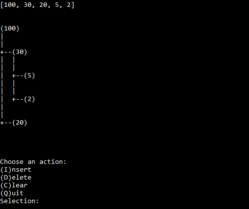
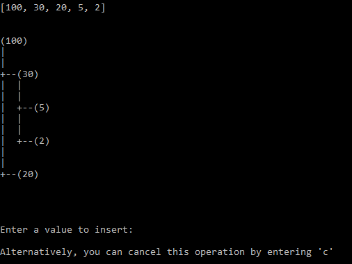
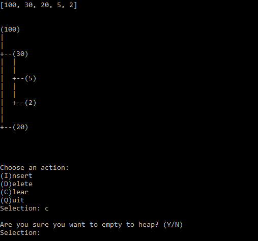

# MaximumBinaryHeap
A C# implementation of a maximum binary heap contained within a class for easy reuse

### What is this project?
This project is a C# implementation of a maximum binary heap done as a personal project. It was originally programmed in December 2019 and uploaded to GitHub in June 2020. The maximum binary heap itself is contained in one class (HeapType.cs) and a second class (HeapTest.cs) to test the heap is also included for demonstrative purposes. I have released it under the MIT license to allow for flexability in reuse. 

### What functionality can HeapType.cs offer?

HeapType stores integer values in a maximum binary heap and automatically manages the integrity of the heap ("PORD", or "Partial Order"). This heap is stored as a list of integers. The list begins with the root, followed by its two children, followed by the two children of each child and so on. Lastly, the list is protected to prevent direct access from outside of the class which would otherwise run the risk of interfering with the integrity of the heap.

The class contains the following functions:
* insert(int n)
  * Insert n into the heap
  * Returns:
    * 1 if successful
    * -1 if the value already exists in the heap
* delete(int n)
  * Delete n from the heap
  * Returns:
    * 1 if successful
    * -1 if the value did not exist in the heap
* search(int n)
  * Searches for n in the heap
  * Returns:
    * The index containing the value n in the list if successful
    * -1 if the value does not exist in the heap
* size()
  * Returns the amount of elements in the heap
* clear()
  * Removes all elements from the heap
  * This function does not return
* list()
  * Prints the list containing the heap to the console
  * Example: "[100, 30, 10, 2, 5]"
  * This function does not return
* tree()
  * Prints the heap to the console represented as a tree
  * See the screenshots below for an example
  * This function does not return
* Other protected functions that are called from within the class to maintain the heap

Please note that all UI in this project comes from the HeapTest class.

### Screenshots

Below are screenshots of this project in use. These screenshots were taken from the project, so HeapTest was used to produce the UI.

*A screenshot of the program in use. The first part of the output shows the list containing the heap using the list() function. The second part is the tree representation using the tree() function. Finally, the last part is the interface implemented in HeapTest.*

*The interface to add a value to the heap*

*The interface to remove all values from the heap*

### References

This project is based on concepts from Algorithms and Data Structures (CSC120) at Hofstra University.
